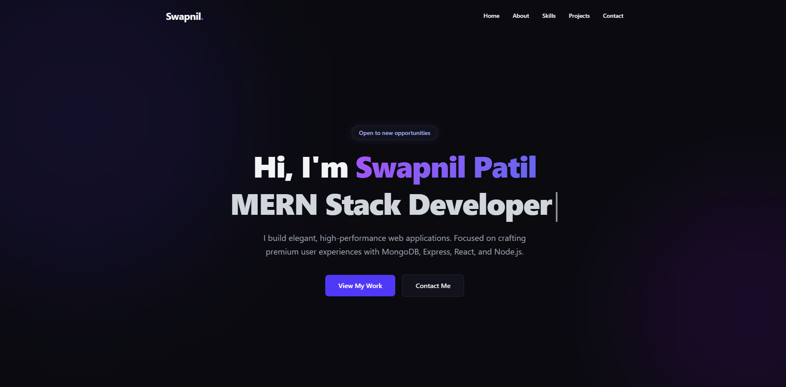

# Swapnil Patil - Developer Portfolio



## 🌟 Overview
A comprehensive, elegant, and fully responsive personal portfolio website showcasing my journey, skills, and projects as a Full Stack MERN Developer. Built to provide a premium user experience with modern web aesthetics, smooth animations, and a cohesive design system.

## ✨ Key Features
- 🎨 **Modern & Premium Design**: Built with Tailwind CSS, featuring glassmorphism cards, glowing backgrounds, and modern typography.
- ⚡ **Dynamic Animations**: Includes subtle scroll animations, a typewriter effect in the hero section, and interactive UI states for heightened user engagement.
- 📱 **Fully Responsive**: Flawless experience across desktops, tablets, and mobile devices.
- ✉️ **Working Contact Form**: Ready-to-use **Formspree** integration for fast, secure messaging and inquiries.
- 📄 **Resume Integration**: Direct download link for a professional CV/Resume PDF seamlessly connected via assets.
- 🚀 **Performance First**: Blazing fast load times leveraging React and Vite.

## 🛠️ Built With
- **Frontend Framework**: React.js
- **Styling**: Tailwind CSS
- **Build Tool**: Vite
- **Form Handling**: Formspree API
- **Version Control**: Git & GitHub

## 💻 Running the Project Locally

To get a local copy up and running, follow these simple steps.

### Prerequisites
Make sure you have [Node.js](https://nodejs.org/) installed on your machine.

### Installation

1. **Clone the repository**
   ```sh
   git clone https://github.com/SwapnilpatilTech/Swap-Portfolio.git
   ```

2. **Navigate into the project directory**
   ```sh
   cd Swap-Portfolio
   ```

3. **Install NPM packages**
   ```sh
   npm install
   ```

4. **Environment Variables Configuration**
   Create a `.env` file in the root directory and add your Formspree form endpoint URL to receive contact form submissions:
   ```env
   VITE_URL=https://formspree.io/f/your_form_endpoint
   ```

5. **Start the development server**
   ```sh
   npm run dev
   ```

6. **View in Browser**
   Access the app at `http://localhost:5173/`

## 🚀 Projects Showcased
- **ERP-System**: Comprehensive ERP platform for employee and organizational resource management built with the MERN stack with secure Authentication.
- **Chat-Application**: Real-time chat application built with React JS and Firebase, featuring live updates.

## 🤝 Connect With Me
- **GitHub**: [SwapnilpatilTech](https://github.com/SwapnilpatilTech)
- **LinkedIn**: [Swapnil Patil](https://www.linkedin.com/in/swapnil-patil22/)

---
*If you like this portfolio or use it as inspiration, feel free to give the repository a ⭐️!*
